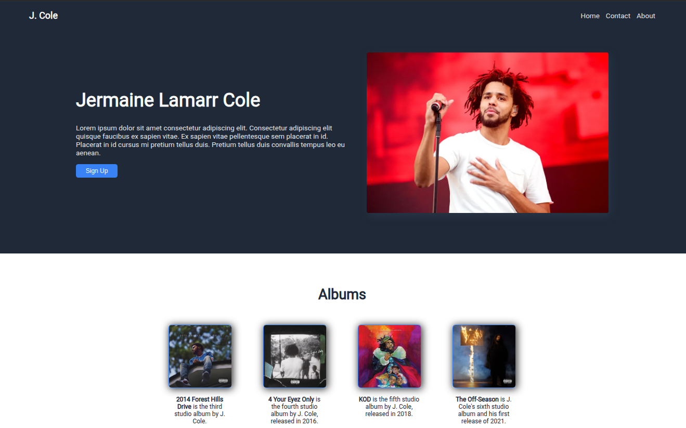

# Landing-Page Project

This is a simple landing page project built as part of **The Odin Project** curriculum.  
It demonstrates fundamental HTML and CSS concepts such as layout, typography, and responsive design.

---

## Preview
Live preview: https://rome1111.github.io/landing-page/

---

## Features
- Header with navigation links  
- Hero section  
- Information cards with placeholder illustrations  
- Testimonial/quote section  
- Secondary call-to-action banner  
- Footer with copyright

---

## Built With
- **HTML**  
- **CSS**  

---

## What I Learned
- Structuring a landing page using semantic HTML  
- Styling layouts with **Flexbox** 

---

## How to Use
1. Clone the repository:
   git clone https://github.com/rome1111/landing-page.git

2. Open <code>index.html</code> in your browser to view the landing page.